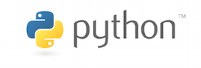

 

### Master 2 DUAS Unistra,  2017-2018

***

# Programmer en Python
***

## Contenu

|  |  |  |  |
| --- | --- | --- | --- |
| **Les généralités** | [notebook](http://nbviewer.jupyter.org/urls/mm2act.pages.math.unistra.fr/cours-python/01-CoursPython-generalites.ipynb) | [diaporama](01-CoursPython-generalites.slides.html) | [archive](ponte-01-CoursPython-generalites.zip) |
| **Le langage (1)** | [notebook](http://nbviewer.jupyter.org/urls/mm2act.pages.math.unistra.fr/cours-python/02-CoursPython-langage.ipynb) | [diaporama](02-CoursPython-langage.slides.html) | [archive](ponte-02-CoursPython-langage.zip) |
| **Le langage (2)** | [notebook](http://nbviewer.jupyter.org/urls/mm2act.pages.math.unistra.fr/cours-python/03-CoursPython-langage.ipynb) | [diaporama](03-CoursPython-langage.slides.html) | [archive](ponte-03-CoursPython-langage.zip) |
| **Numpy**  | [notebook](http://nbviewer.jupyter.org/urls/mm2act.pages.math.unistra.fr/cours-python/04-CoursPython-numpy.ipynb) | [diaporama](04-CoursPython-numpy.slides.html) | [archive](ponte-04-CoursPython-numpy.zip) |
| **Microprojet** | [notebook](http://nbviewer.jupyter.org/urls/mm2act.pages.math.unistra.fr/cours-python/05-CoursPython-microprojet.ipynb) | [diaporama](05-CoursPython-microprojet.slides.html) | [archive](ponte-05-CoursPython-microprojet.zip) |
| **Le langage (3)** | | |

***
Matthieu Boileau - [matthieu.boileau@math.unistra.fr](mailto: matthieu.boileau@math.unistra.fr)

*Contenu sous licence [CC BY-SA 4.0](https://creativecommons.org/licenses/by-sa/4.0)*

